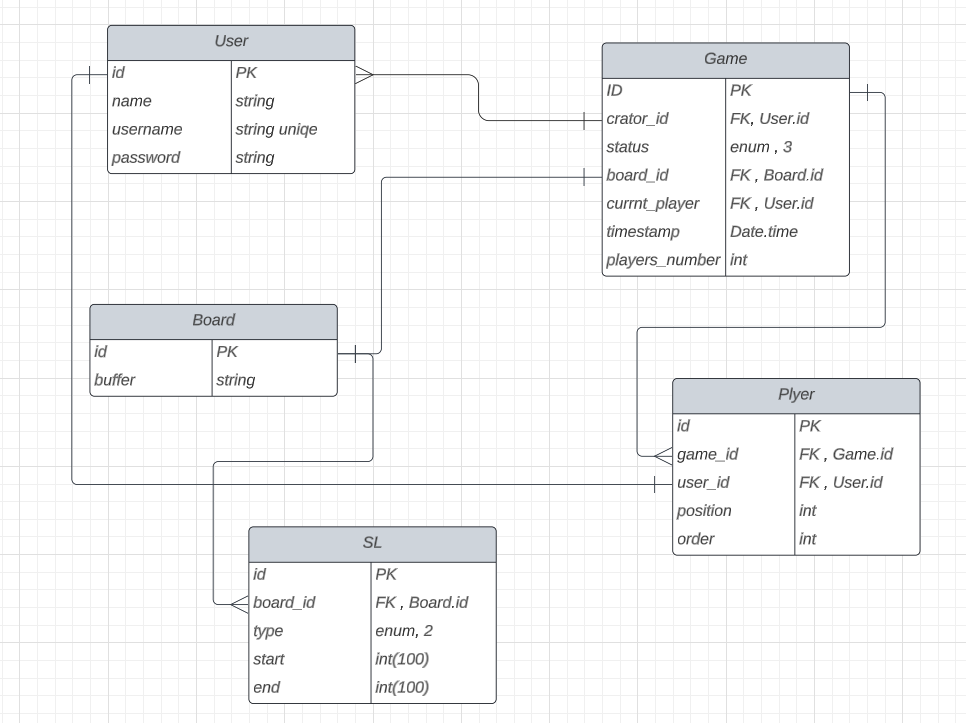

# Documentation

> **[Enozom](https://enozom.com/)** Internship *The Project* - **Group D** - 2023

## The Project : <small><small>Snake and Ladder</small></small>

Snake and Ladder As a team of 4-6 interns, your task is to design and develop a multiplayer Snake and Ladder game using Node.js for the backend and React.js for thc frontend.
The game should meet the following functional and technical

### requirements

- User Registration and Login: Implement a user registration and login system that allows players to create an account and retrieve their game progress at any time. Registration will include only a username and password.
- Game Creation and Joining: Enable players to create a new game and wait for other players to join. Once the required number of players is reached, the game should automatically start.
- Graphical User Interface: Develop a visually appealing graphical user interface that presents the game board, players, dice, snakes, and ladders. Consider adding animations for dice rolls and player moves to enhance the user experience.

### Technical Requirements

- Board Image Embedding: Embed the game board as a background image to avoid drawing it at runtime.
- Canvas Implementation: Use canvas to draw the game board, players, dice, snakes, and ladders dynamically on the frontend.
- MySQL Database Integration: Save game information, player moves, game state, and player data in a MySQL database for persistent storage and retrieval.
- Socket.io Integration: Utilize socket.io to establish real-time communication between the server and players' front-end. This will allow for seamless updates and synchronization of game state during gameplay.

Please ensure proper collaboration and division of tasks among team members, considering their strengths and expertise in both backend (Node.js) and frontend (React.js) development. Regularly communicate and coordinate with each other to ensure a cohesive and successful implementation of the multiplayer Snake and Ladder game. Use GitHub or Bitbucket to share the code across the team members.

## Classes

1. **User**
   - Methods:
     - **`register(username: string, password: string): void`**
     - **`login(username: string, password: string): User`**
2. **Game**
   - Methods:
     - **`createGame(creator: User): Game`**
     - **`joinGame(game: Game, user: User): void`**
     - **`startGame(game: Game): void`**
     - **`getPlayers(game: Game): Player[]`**
     - **`endGame(game: Game): void`**
     - **`getGameStatus(game: Game): string`**
3. **Player**
   - Methods:
     - **`movePlayer(player: Player, rollValue: int): void`**
     - **`getCurrentPosition(player: Player): int`**

## UML Diagram

> Schema: <https://lucid.app/lucidchart/3b81569b-b937-49cf-8cfa-7e3ba02b3a89/edit?viewport_loc=325%2C216%2C1171%2C711%2C0_0&invitationId=inv_13931817-4b47-496a-a92c-811cb6bad3ec>

<!-- call image.png -->

---

## References and Resources

- [Node.js](https://nodejs.org/en/)
- [React.js](https://reactjs.org/)
- [Express](https://expressjs.com/)
- [MySQL](https://www.mysql.com/)
- [MySQL Workbench](https://www.mysql.com/products/workbench/)
- [Sequelize](https://sequelize.org/)
- [Socket.io](https://socket.io/)
- [Morgan](https://www.npmjs.com/package/morgan)
- [Bcrypt](https://www.npmjs.com/package/bcrypt)
- [JWT](https://jwt.io/)
- [multer](https://www.npmjs.com/package/multer)
- [nodemon](https://www.npmjs.com/package/nodemon)
- [Faker](https://www.npmjs.com/package/faker)

---

## Contributors

[ [Kirollos Atef](https://github.com/kirollosatef) - [Hazem Hamed](https://github.com/orgs/EnozomProjectGroupD/people/Hazem020) - [Mario Wilson](https://github.com/orgs/EnozomProjectGroupD/people/Hazem020) - [Mohamed Elemam](https://github.com/orgs/EnozomProjectGroupD/people/Mohamed-Elemam) - [Esraa Dwidar](https://github.com/orgs/EnozomProjectGroupD/people/EsraaDwidar) ]
